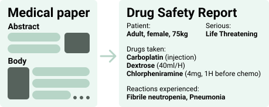

<p align="center" width="100%">

</p>

# BioDEX: Large-Scale Biomedical Adverse Drug Event Extraction for Real-World Pharmacovigilance.

[](https://opensource.org/licenses/MIT)
[](https://www.python.org/downloads/release/python-390/)

This is the official repository for the [BioDEX paper](todo).

BioDEX is a raw resource for drug safety monitoring that bundles full-text and abstract-only PubMed papers with drug safety reports. These reports contain structured information about an Adverse Drug Events (ADEs) described in the papers, and are produced by medical experts in real-world settings.

BioDEX contains 19k full-text papers, 65k abstracts, and over 256k associated drug-safety reports.

Our data and models are available on [Hugging Face](https://huggingface.co/BioDEX).


## Overview of this repository
This repository is structured as follows:
- `demo.ipynb` contains some quick demonstrations of the data.
- `analysis/` contains the data and notebooks to reproduce all plots in the paper.
- `src/` contains all code to represent the data objects and calculate the metrics.
- `data_creation/` contains the code to create the Report-Extraction dataset starting from the raw resource. Code to create the raw resource from scratch from will be released soon.
- `task/icsr_extraction/` contains the code to train and evaluate models for the Report-Extraction task.

## Overview of this readme
- [Installation](#installation)
- [Demos](#demos)
- [Train and Evaluate models](#train-and-evaluate-report-extraction-models)
- [Limitations](#limitations)
- [Contact](#contact)
- [License](#license)
- [Citation](#citation)
- [BioDEX Data Schema](#biodex-data-schema)

## Installation
Create the conda environment and install the code: 

    conda create -n biodex python=3.9
    conda activate biodex
    pip install -r requirements.txt
    pip install .

## Demos

### Load the raw resource
```python
import datasets

# load the raw dataset
dataset = datasets.load_dataset("BioDEX/raw_dataset")['train']

print(len(dataset)) # 65,648

# investigate an example
article = dataset[1]['article']
report = dataset[1]['reports'][0]

print(article['title'])    # Case Report: Perioperative Kounis Syndrome in an Adolescent With Congenital Glaucoma.
print(article['abstract']) # A 12-year-old male patient suffering from congenital glaucoma developed bradycardia, ...
print(article['fulltext']) # ...
print(article['fulltext_license']) # CC BY

print(report['patient']['patientsex']) # 1
print(report['patient']['drug'][0]['activesubstance']['activesubstancename']) # ATROPINE SULFATE
print(report['patient']['drug'][0]['drugadministrationroute']) # 040
print(report['patient']['drug'][1]['activesubstance']['activesubstancename']) # MIDAZOLAM
print(report['patient']['drug'][1]['drugindication']) # Anaesthesia
print(report['patient']['reaction'][0]['reactionmeddrapt'])  # Kounis syndrome
print(report['patient']['reaction'][1]['reactionmeddrapt'])  # Hypersensitivity
```

Optional, use our code to parse the raw resource into Python objects for easy manipulation
```python
import datasets
from src.utils import get_matches

# load the raw dataset
dataset = datasets.load_dataset("BioDEX/raw_dataset")['train']
dataset = get_matches(dataset)

print(len(dataset)) # 65,648

# investigate an example
article = dataset[1].article
report = dataset[1].reports[0]

print(article.title)    # Case Report: Perioperative Kounis Syndrome in an Adolescent With Congenital Glaucoma.
print(article.abstract) # A 12-year-old male patient suffering from congenital glaucoma developed bradycardia, ...
print(article.fulltext) # ...
print(article.fulltext_license) # CC BY

print(report.patient.patientsex) # 1
print(report.patient.drug[0].activesubstance.activesubstancename) # ATROPINE SULFATE
print(report.patient.drug[0].drugadministrationroute) # 040
print(report.patient.drug[1].activesubstance.activesubstancename) # MIDAZOLAM
print(report.patient.drug[1].drugindication) # Anaesthesia
print(report.patient.reaction[0].reactionmeddrapt)  # Kounis syndrome
print(report.patient.reaction[1].reactionmeddrapt)  # Hypersensitivity
```

### Load the Report-Extraction dataset
```python
import datasets

# load the report-extraction dataset
dataset = datasets.load_dataset("BioDEX/BioDEX-ICSR")

print(len(dataset['train']))        # 9,624
print(len(dataset['validation']))   # 2,407
print(len(dataset['test']))         # 3,628

example = dataset['train'][0]

print(example['fulltext_processed'][:1000], '...') # TITLE: # SARS-CoV-2-related ARDS in a maintenance hemodialysis patient ...
print(example['target']) # serious: 1 patientsex: 1 drugs: ACETAMINOPHEN, ASPIRIN ...
```

## Use our fine-tuned Report-Extraction model
```python
from transformers import AutoTokenizer, T5ForConditionalGeneration
import datasets

# load the report-extraction dataset
dataset = datasets.load_dataset("BioDEX/BioDEX-ICSR")

# load the model
model_path = "BioDEX/flan-t5-large-report-extraction"
model = T5ForConditionalGeneration.from_pretrained(model_path)
tokenizer = AutoTokenizer.from_pretrained(model_path)

# get an input and encode it
input = dataset['validation'][1]['fulltext_processed']
input_encoded = tokenizer(input, max_length=2048, truncation=True, padding="max_length", return_tensors='pt')

# forward pass
output_encoded = model.generate(**input_encoded, max_length=256)

output = tokenizer.batch_decode(output_encoded, skip_special_tokens=True)
output = output[0]

print(output) # serious: 1 patientsex: 2 drugs: AMLODIPINE BESYLATE, LISINOPRIL reactions: Intentional overdose, Metabolic acidosis, Shock``` -->
```

## Train and evaluate Report-Extraction models
All code for this task is located in `task/icsr_extraction/`.
Make sure to activate the `biodex` environment!

### Fine-tune a new Report-Extraction model
```shell
cd tasks/icsr_extraction

python run_encdec_for_icsr_extraction.py \
    --overwrite_cache False \
    --seed 42 \
    --dataset_name BioDEX/BioDEX-ICSR \
    --text_column fulltext_processed \
    --summary_column target \
    --model_name_or_path google/flan-t5-large \
    --output_dir ../../checkpoints/flan-t5-large-report-extraction \
    --max_source_length 2048 \
    --max_target_length 256 \
    --do_train True \
    --do_eval True \
    --lr_scheduler_type linear \
    --warmup_ratio 0.0 \
    --learning_rate 0.0001 \
    --optim adafactor \
    --per_device_train_batch_size 1 \
    --per_device_eval_batch_size 4 \
    --gradient_accumulation_steps 4 \
    --eval_accumulation_steps 16 \
    --num_train_epochs 5 \
    --bf16 True \
    --evaluation_strategy epoch \
    --logging_strategy steps \
    --save_strategy epoch \
    --logging_steps 100 \
    --save_total_limit 1 \
    --report_to wandb \
    --load_best_model_at_end True \
    --metric_for_best_model loss \
    --greater_is_better False \
    --predict_with_generate True \
    --generation_max_length 256 \
    --num_beams 1 \
    --repetition_penalty 1.0
```
Thus far, we only consider fine-tuning encoder-decooder models in the paper. Training a decoder-only model is still a work in progress, but we've supplied some code at `./tasks/icsr_extraction/run_decoder_for_icsr_extraction.py`

### Reproduce our fine-tune evaluation run
Using our model on Hugging Face.

```shell
cd tasks/icsr_extraction

python run_encdec_for_icsr_extraction.py \
    --overwrite_cache False \
    --seed 42 \
    --dataset_name BioDEX/BioDEX-ICSR \
    --text_column fulltext_processed \
    --summary_column target \
    --model_name_or_path BioDEX/flan-t5-large-report-extraction \
    --output_dir ../../checkpoints/flan-t5-large-report-extraction \
    --max_source_length 2048 \
    --max_target_length 256 \
    --do_train False \
    --do_eval True \
    --lr_scheduler_type linear \
    --warmup_ratio 0.0 \
    --learning_rate 0.0001 \
    --optim adafactor \
    --per_device_train_batch_size 1 \
    --per_device_eval_batch_size 4 \
    --gradient_accumulation_steps 4 \
    --eval_accumulation_steps 16 \
    --num_train_epochs 5 \
    --bf16 True \
    --evaluation_strategy epoch \
    --logging_strategy steps \
    --save_strategy epoch \
    --logging_steps 100 \
    --save_total_limit 1 \
    --report_to wandb \
    --load_best_model_at_end True \
    --metric_for_best_model loss \
    --greater_is_better False \
    --predict_with_generate True \
    --generation_max_length 256 \
    --num_beams 1 \
    --repetition_penalty 1.0
```

### Reproduce our few-shot in-context learning results
We use the [DSP](https://github.com/stanfordnlp/dsp) framework to perform in-context learning experiments.

At the time of writing, DSP does not support a truncation strategy. This is vital for our task given the long inputs. To fix this and reproduce our results, you need to replace the `predict.py` file of your local dsp package (`path/to/local/dsp/primitives/predict.py`) with the adapted version located at `tasks/icsr_extraction/dsp_predict_path.py`.

Run `text-davinci-003`:
```shell

cd tasks/icsr_extraction

python run_gpt3_for_icsr_extraction.py \
    --max_dev_samples 100 \
    --max_tokens 128 \
    --max_prompt_length 4096 \
    --n_demos 7 \
    --output_dir ../../checkpoints/ \
    --model_name text-davinci-003 \
    --fulltext True
```

Run `gpt-4`:
```shell

cd tasks/icsr_extraction

python run_gpt3_for_icsr_extraction.py \
    --max_dev_samples 20 \
    --max_tokens 128 \
    --max_prompt_length 4096 \
    --n_demos 7 \
    --output_dir ../../checkpoints/ \
    --model_name gpt-4 \
    --chat_model True \
    --fulltext True
```

## Limitations
See section 9 of the [BioDEX paper](todo) for limitations and ethical considerations.

## Contact
Open an issue on this GitHub page or email `karel[dot]doosterlinck[at]ugent[dot].be` and preferrably include "[BioDEX]" in the subject.

## License
BioDEX bundles the following resources:
- [Medline](https://pubmed.ncbi.nlm.nih.gov): This produces all `article` fields except `fulltext` and `fulltext_license`
- [FAERS](https://www.fda.gov/drugs/questions-and-answers-fdas-adverse-event-reporting-system-faers/fda-adverse-event-reporting-system-faers-public-dashboard): This produces all `report` fields and is covered under a CC0 license, as stated [on their website](https://open.fda.gov/data/faers/).
- [PubMed Central Open Access Subset](https://www.ncbi.nlm.nih.gov/pmc/tools/openftlist/): This produced the `fulltext` and `fulltext_license` fields for the `article`. The PubMed Open Access Subset covers papers that are copyrighted under Creative Commens or similar liberal distributions. BioDEX features full-text papers from the commercial (CC0, CC BY, CC BY-SA, CC BY-ND) and non-commercial (CC BY-NC, CC BY-NC-SA, CC BY-NC-ND) set. This license is denoted per applicable BioDEX example in the `fulltext_license` field of the `article`. 

Medline was provided by courtesy of the U.S. National Library of Medicine (NLM). This does not imply the NLM has endorsed BioDEX. The data distributed in BioDEX does not reflect the most current/accurate data available from NLM.

### Create a smaller, commercially licensed BioDEX dataset
Filter the raw resource to only include fulltext papers with a commercial license:

```python
import datasets

# load the raw dataset
dataset = datasets.load_dataset("BioDEX/raw_dataset")['train']
print(len(dataset)) # 65,648

# remove all fulltext papers with no commercial license
commercial_licenses = {'CC0', 'CC BY', 'CC BY-SA', 'CC BY-ND'}

def remove_noncom_paper(example):
    # remove the fulltext if no commercial license, keep all the other data of the example
    if example['article']['fulltext_license'] not in commercial_licenses:
        example['article']['fulltext'] = None
    return example

dataset_commercial = dataset.map(remove_noncom_paper)
print(len(dataset_commercial)) # 65,648 (no examples were dropped, only some fulltext fields were removed)
```

If you want to train a report-extraction model on this commercial dataset, repeat the steps outlined in `data_creation/icsr_extraction/icsr_extraction.ipynb` with this new `dataset_commercial` to create a new report-extraction dataset.

## Citation
Coming soon.

## BioDEX data schema

### Article fields
[View in fullscreen](analysis/schemas/article_fields_table.html). (Adapted from [pubmed-parser](https://github.com/titipata/pubmed_parser))
<div style="width: 100%; height: 100px; overflow-y: scroll; overflow-x: scroll;">
    <table border="1" class="dataframe">
  <thead>
    <tr style="text-align: right;">
      <th>fields</th>
      <th>description</th>
    </tr>
  </thead>
  <tbody>
    <tr>
      <td>title</td>
      <td>Title of the article</td>
    </tr>
    <tr>
      <td>pmid</td>
      <td>PubMed ID</td>
    </tr>
    <tr>
      <td>issue</td>
      <td>The Issue of the journal</td>
    </tr>
    <tr>
      <td>pages</td>
      <td>Pages of the article in the journal publication</td>
    </tr>
    <tr>
      <td>abstract</td>
      <td>Abstract of the article</td>
    </tr>
    <tr>
      <td>fulltext</td>
      <td>The full text associated with the article from the PubMed Central Open Access Subset, if available</td>
    </tr>
    <tr>
      <td>fulltext_license</td>
      <td>The license associated with the full text paper from the PubMed Central Open Access Subset, if available</td>
    </tr>
    <tr>
      <td>journal</td>
      <td>Journal of the given paper</td>
    </tr>
    <tr>
      <td>authors</td>
      <td>Authors, each separated by ';'</td>
    </tr>
    <tr>
      <td>affiliations</td>
      <td>The affiliations of the authors</td>
    </tr>
    <tr>
      <td>pubdate</td>
      <td>Publication date. Defaults to year information only.</td>
    </tr>
    <tr>
      <td>doi</td>
      <td>DOI</td>
    </tr>
    <tr>
      <td>medline_ta</td>
      <td>Abbreviation of the journal name</td>
    </tr>
    <tr>
      <td>nlm_unique_id</td>
      <td>NLM unique identification</td>
    </tr>
    <tr>
      <td>issn_linking</td>
      <td>ISSN linkage, typically use to link with Web of Science dataset</td>
    </tr>
    <tr>
      <td>country</td>
      <td>Country extracted from journal information field</td>
    </tr>
    <tr>
      <td>mesh_terms</td>
      <td>List of MeSH terms with corresponding MeSH ID, each separated by ';' e.g. 'D000161:Acoustic Stimulation; D000328:Adult; ...'</td>
    </tr>
    <tr>
      <td>publication_types</td>
      <td>List of publication type list each separated by ';' e.g. 'D016428:Journal Article'</td>
    </tr>
    <tr>
      <td>chemical_list</td>
      <td>List of chemical terms, each separated by ';'</td>
    </tr>
    <tr>
      <td>keywords</td>
      <td>List of keywords, each separated by ';'</td>
    </tr>
    <tr>
      <td>reference</td>
      <td>String of PMID each separated by ';' or list of references made to the article</td>
    </tr>
    <tr>
      <td>delete</td>
      <td>Boolean, 'False' means paper got updated so you might have two</td>
    </tr>
    <tr>
      <td>pmc</td>
      <td>PubMed Central ID</td>
    </tr>
    <tr>
      <td>other_id</td>
      <td>Other IDs found, each separated by ';'</td>
    </tr>
  </tbody>
</table>
</div>
<br>

### Report fields
[View in fullscreen](analysis/schemas/report_fields_table.html). (Adapted from [OpenFDA] (https://open.fda.gov/apis/openfda-fields/))

<div style="width: 100%; height: 300px; overflow-x: scroll;">
<table border="1" class="dataframe">
  <thead>
    <tr style="text-align: right;">
      <th>fields</th>
      <th>description</th>
      <th>values</th>
    </tr>
  </thead>
  <tbody>
    <tr>
      <td>authoritynumb</td>
      <td>Populated with the Regulatory Authority’s case report number, when available.</td>
      <td>Undefined</td>
    </tr>
    <tr>
      <td>companynumb</td>
      <td>Identifier for the company providing the report. This is self-assigned.</td>
      <td>Undefined</td>
    </tr>
    <tr>
      <td>duplicate</td>
      <td>This value is `1` if earlier versions of this report were submitted to FDA. openFDA only shows the most recent version.</td>
      <td>Undefined</td>
    </tr>
    <tr>
      <td>fulfillexpeditecriteria</td>
      <td>Identifies expedited reports (those that were processed within 15 days).</td>
      <td>1: True, 2: False</td>
    </tr>
    <tr>
      <td>occurcountry</td>
      <td>The name of the country where the event occurred.</td>
      <td>name: Country codes, link: http://data.okfn.org/data/core/country-list</td>
    </tr>
    <tr>
      <td>patient.drug.items.actiondrug</td>
      <td>Actions taken with the drug.</td>
      <td>1: Drug withdrawn, 2: Dose reduced, 3: Dose increased, 4: Dose not changed, 5: Unknown, 6: Not applicable</td>
    </tr>
    <tr>
      <td>patient.drug.items.activesubstance.activesubstancename</td>
      <td>Product active ingredient, which may be different than other drug identifiers (when provided).</td>
      <td>Undefined</td>
    </tr>
    <tr>
      <td>patient.drug.items.drugadditional</td>
      <td>Dechallenge outcome information—whether the event abated after product use stopped or the dose was reduced. Only present when this was attempted and the data was provided.</td>
      <td>1: Yes, 2: No, 3: Does not apply</td>
    </tr>
    <tr>
      <td>patient.drug.items.drugadministrationroute</td>
      <td>The drug’s route of administration.</td>
      <td>001: Auricular (otic), 002: Buccal, 003: Cutaneous, 004: Dental, 005: Endocervical, 006: Endosinusial, 007: Endotracheal, 008: Epidural, 009: Extra-amniotic, 010: Hemodialysis, 011: Intra corpus cavernosum, 012: Intra-amniotic, 013: Intra-arterial, 014: Intra-articular, 015: Intra-uterine, 016: Intracardiac, 017: Intracavernous, 018: Intracerebral, 019: Intracervical, 020: Intracisternal, 021: Intracorneal, 022: Intracoronary, 023: Intradermal, 024: Intradiscal (intraspinal), 025: Intrahepatic, 026: Intralesional, 027: Intralymphatic, 028: Intramedullar (bone marrow), 029: Intrameningeal, 030: Intramuscular, 031: Intraocular, 032: Intrapericardial, 033: Intraperitoneal, 034: Intrapleural, 035: Intrasynovial, 036: Intratumor, 037: Intrathecal, 038: Intrathoracic, 039: Intratracheal, 040: Intravenous bolus, 041: Intravenous drip, 042: Intravenous (not otherwise specified), 043: Intravesical, 044: Iontophoresis, 045: Nasal, 046: Occlusive dressing technique, 047: Ophthalmic, 048: Oral, 049: Oropharingeal, 050: Other, 051: Parenteral, 052: Periarticular, 053: Perineural, 054: Rectal, 055: Respiratory (inhalation), 056: Retrobulbar, 057: Sunconjunctival, 058: Subcutaneous, 059: Subdermal, 060: Sublingual, 061: Topical, 062: Transdermal, 063: Transmammary, 064: Transplacental, 065: Unknown, 066: Urethral, 067: Vaginal</td>
    </tr>
    <tr>
      <td>patient.drug.items.drugauthorizationnumb</td>
      <td>Drug authorization or application number (NDA or ANDA), if provided.</td>
      <td>Undefined</td>
    </tr>
    <tr>
      <td>patient.drug.items.drugbatchnumb</td>
      <td>Drug product lot number, if provided.</td>
      <td>Undefined</td>
    </tr>
    <tr>
      <td>patient.drug.items.drugcharacterization</td>
      <td>Reported role of the drug in the adverse event report. These values are not validated by FDA.</td>
      <td>1: Suspect (the drug was considered by the reporter to be the cause), 2: Concomitant (the drug was reported as being taken along with the suspect drug), 3: Interacting (the drug was considered by the reporter to have interacted with the suspect drug)</td>
    </tr>
    <tr>
      <td>patient.drug.items.drugcumulativedosagenumb</td>
      <td>The cumulative dose taken until the first reaction was experienced, if provided.</td>
      <td>Undefined</td>
    </tr>
    <tr>
      <td>patient.drug.items.drugcumulativedosageunit</td>
      <td>The unit for `drugcumulativedosagenumb`.</td>
      <td>001: kg (kilograms), 002: g (grams), 003: mg (milligrams), 004: µg (micrograms)</td>
    </tr>
    <tr>
      <td>patient.drug.items.drugdosageform</td>
      <td>The drug’s dosage form. There is no standard, but values may include terms like `tablet` or `solution for injection`.</td>
      <td>Undefined</td>
    </tr>
    <tr>
      <td>patient.drug.items.drugdosagetext</td>
      <td>Additional detail about the dosage taken. Frequently unknown, but occasionally including information like a brief textual description of the schedule of administration.</td>
      <td>Undefined</td>
    </tr>
    <tr>
      <td>patient.drug.items.drugenddate</td>
      <td>Date the patient stopped taking the drug.</td>
      <td>Undefined</td>
    </tr>
    <tr>
      <td>patient.drug.items.drugenddateformat</td>
      <td>Encoding format of the field `drugenddateformat`. Always set to `102` (YYYYMMDD).</td>
      <td>Undefined</td>
    </tr>
    <tr>
      <td>patient.drug.items.drugindication</td>
      <td>Indication for the drug’s use.</td>
      <td>Undefined</td>
    </tr>
    <tr>
      <td>patient.drug.items.drugintervaldosagedefinition</td>
      <td>The unit for the interval in the field `drugintervaldosageunitnumb.`</td>
      <td>801: Year, 802: Month, 803: Week, 804: Day, 805: Hour, 806: Minute, 807: Trimester, 810: Cyclical, 811: Trimester, 812: As necessary, 813: Total</td>
    </tr>
    <tr>
      <td>patient.drug.items.drugintervaldosageunitnumb</td>
      <td>Number of units in the field `drugintervaldosagedefinition`.</td>
      <td>Undefined</td>
    </tr>
    <tr>
      <td>patient.drug.items.drugrecurreadministration</td>
      <td>Whether the reaction occured after readministration of the drug.</td>
      <td>1: Yes, 2: No, 3: Unknown</td>
    </tr>
    <tr>
      <td>patient.drug.items.drugrecurrence.drugrecuraction</td>
      <td>Populated with the Reaction/Event information if/when `drugrecurreadministration` equals `1`.</td>
      <td>Undefined</td>
    </tr>
    <tr>
      <td>patient.drug.items.drugrecurrence.drugrecuractionmeddraversion</td>
      <td>The version of MedDRA from which the term in `drugrecuraction` is drawn.</td>
      <td>Undefined</td>
    </tr>
    <tr>
      <td>patient.drug.items.drugseparatedosagenumb</td>
      <td>The number of separate doses that were administered.</td>
      <td>Undefined</td>
    </tr>
    <tr>
      <td>patient.drug.items.drugstartdate</td>
      <td>Date the patient began taking the drug.</td>
      <td>Undefined</td>
    </tr>
    <tr>
      <td>patient.drug.items.drugstartdateformat</td>
      <td>Encoding format of the field `drugstartdate`. Always set to `102` (YYYYMMDD).</td>
      <td>Undefined</td>
    </tr>
    <tr>
      <td>patient.drug.items.drugstructuredosagenumb</td>
      <td>The number portion of a dosage; when combined with `drugstructuredosageunit` the complete dosage information is represented. For example, *300* in `300 mg`.</td>
      <td>Undefined</td>
    </tr>
    <tr>
      <td>patient.drug.items.drugstructuredosageunit</td>
      <td>The unit for the field `drugstructuredosagenumb`. For example, *mg* in `300 mg`.</td>
      <td>001: kg (kilograms), 002: g (grams), 003: mg (milligrams), 004: µg (micrograms)</td>
    </tr>
    <tr>
      <td>patient.drug.items.drugtreatmentduration</td>
      <td>The interval of the field `drugtreatmentdurationunit` for which the patient was taking the drug.</td>
      <td>Undefined</td>
    </tr>
    <tr>
      <td>patient.drug.items.drugtreatmentdurationunit</td>
      <td>None</td>
      <td>801: Year, 802: Month, 803: Week, 804: Day, 805: Hour, 806: Minute</td>
    </tr>
    <tr>
      <td>patient.drug.items.medicinalproduct</td>
      <td>Drug name. This may be the valid trade name of the product (such as `ADVIL` or `ALEVE`) or the generic name (such as `IBUPROFEN`). This field is not systematically normalized. It may contain misspellings or idiosyncratic descriptions of drugs, such as combination products such as those used for birth control.</td>
      <td>Undefined</td>
    </tr>
    <tr>
      <td>patient.patientagegroup</td>
      <td>Populated with Patient Age Group code.</td>
      <td>1: Neonate, 2: Infant, 3: Child, 4: Adolescent, 5: Adult, 6: Elderly</td>
    </tr>
    <tr>
      <td>patient.patientdeath.patientdeathdate</td>
      <td>If the patient died, the date that the patient died.</td>
      <td>Undefined</td>
    </tr>
    <tr>
      <td>patient.patientdeath.patientdeathdateformat</td>
      <td>Encoding format of the field `patientdeathdate`. Always set to `102` (YYYYMMDD).</td>
      <td>Undefined</td>
    </tr>
    <tr>
      <td>patient.patientonsetage</td>
      <td>Age of the patient when the event first occured.</td>
      <td>Undefined</td>
    </tr>
    <tr>
      <td>patient.patientonsetageunit</td>
      <td>The unit for the interval in the field `patientonsetage.`</td>
      <td>800: Decade, 801: Year, 802: Month, 803: Week, 804: Day, 805: Hour</td>
    </tr>
    <tr>
      <td>patient.patientsex</td>
      <td>The sex of the patient.</td>
      <td>0: Unknown, 1: Male, 2: Female</td>
    </tr>
    <tr>
      <td>patient.patientweight</td>
      <td>The patient weight, in kg (kilograms).</td>
      <td>Undefined</td>
    </tr>
    <tr>
      <td>patient.reaction.items.reactionmeddrapt</td>
      <td>Patient reaction, as a MedDRA term. Note that these terms are encoded in British English. For instance, diarrhea is spelled `diarrohea`. MedDRA is a standardized medical terminology.</td>
      <td>name: MedDRA, link: http://www.fda.gov/ForIndustry/DataStandards/StructuredProductLabeling/ucm162038.htm</td>
    </tr>
    <tr>
      <td>patient.reaction.items.reactionmeddraversionpt</td>
      <td>The version of MedDRA from which the term in `reactionmeddrapt` is drawn.</td>
      <td>Undefined</td>
    </tr>
    <tr>
      <td>patient.reaction.items.reactionoutcome</td>
      <td>Outcome of the reaction in `reactionmeddrapt` at the time of last observation.</td>
      <td>1: Recovered/resolved, 2: Recovering/resolving, 3: Not recovered/not resolved, 4: Recovered/resolved with sequelae (consequent health issues), 5: Fatal, 6: Unknown</td>
    </tr>
    <tr>
      <td>patient.summary.narrativeincludeclinical</td>
      <td>Populated with Case Event Date, when available; does `NOT` include Case Narrative.</td>
      <td>Undefined</td>
    </tr>
    <tr>
      <td>primarysource.literaturereference</td>
      <td>Populated with the Literature Reference information, when available.</td>
      <td>Undefined</td>
    </tr>
    <tr>
      <td>primarysource.qualification</td>
      <td>Category of individual who submitted the report.</td>
      <td>1: Physician, 2: Pharmacist, 3: Other health professional, 4: Lawyer, 5: Consumer or non-health professional</td>
    </tr>
    <tr>
      <td>primarysource.reportercountry</td>
      <td>Country from which the report was submitted.</td>
      <td>Undefined</td>
    </tr>
    <tr>
      <td>primarysourcecountry</td>
      <td>Country of the reporter of the event.</td>
      <td>name: Country codes, link: http://data.okfn.org/data/core/country-list</td>
    </tr>
    <tr>
      <td>receiptdate</td>
      <td>Date that the _most recent_ information in the report was received by FDA.</td>
      <td>Undefined</td>
    </tr>
    <tr>
      <td>receiptdateformat</td>
      <td>Encoding format of the `transmissiondate` field. Always set to 102 (YYYYMMDD).</td>
      <td>Undefined</td>
    </tr>
    <tr>
      <td>receivedate</td>
      <td>Date that the report was _first_ received by FDA. If this report has multiple versions, this will be the date the first version was received by FDA.</td>
      <td>Undefined</td>
    </tr>
    <tr>
      <td>receivedateformat</td>
      <td>Encoding format of the `transmissiondate` field. Always set to 102 (YYYYMMDD).</td>
      <td>Undefined</td>
    </tr>
    <tr>
      <td>receiver.receiverorganization</td>
      <td>Name of the organization receiving the report. Because FDA received the report, the value is always `FDA`.</td>
      <td>Undefined</td>
    </tr>
    <tr>
      <td>receiver.receivertype</td>
      <td>The type of organization receiving the report. The value,`6`, is only specified if it is `other`, otherwise it is left blank.</td>
      <td>6: Other</td>
    </tr>
    <tr>
      <td>reportduplicate.duplicatenumb</td>
      <td>The case identifier for the duplicate.</td>
      <td>Undefined</td>
    </tr>
    <tr>
      <td>reportduplicate.duplicatesource</td>
      <td>The name of the organization providing the duplicate.</td>
      <td>Undefined</td>
    </tr>
    <tr>
      <td>reporttype</td>
      <td>Code indicating the circumstances under which the report was generated.</td>
      <td>1: Spontaneous, 2: Report from study, 3: Other, 4: Not available to sender (unknown)</td>
    </tr>
    <tr>
      <td>safetyreportid</td>
      <td>The 8-digit Safety Report ID number, also known as the case report number or case ID. The first 7 digits (before the hyphen) identify an individual report and the last digit (after the hyphen) is a checksum. This field can be used to identify or find a specific adverse event report.</td>
      <td>Undefined</td>
    </tr>
    <tr>
      <td>safetyreportversion</td>
      <td>The version number of the `safetyreportid`. Multiple versions of the same report may exist, it is generally best to only count the latest report and disregard others. openFDA will only return the latest version of a report.</td>
      <td>Undefined</td>
    </tr>
    <tr>
      <td>sender.senderorganization</td>
      <td>Name of the organization sending the report. Because FDA is providing these reports to you, the value is always `FDA-Public Use.`</td>
      <td>Undefined</td>
    </tr>
    <tr>
      <td>sender.sendertype</td>
      <td>The name of the organization sending the report. Because FDA is providing these reports to you, the value is always `2`.</td>
      <td>2: Regulatory authority</td>
    </tr>
    <tr>
      <td>serious</td>
      <td>Seriousness of the adverse event.</td>
      <td>1: The adverse event resulted in death, a life threatening condition, hospitalization, disability, congenital anomaly, or other serious condition, 2: The adverse event did not result in any of the above</td>
    </tr>
    <tr>
      <td>seriousnesscongenitalanomali</td>
      <td>This value is `1` if the adverse event resulted in a congenital anomaly, and absent otherwise.</td>
      <td>Undefined</td>
    </tr>
    <tr>
      <td>seriousnessdeath</td>
      <td>This value is `1` if the adverse event resulted in death, and absent otherwise.</td>
      <td>Undefined</td>
    </tr>
    <tr>
      <td>seriousnessdisabling</td>
      <td>This value is `1` if the adverse event resulted in disability, and absent otherwise.</td>
      <td>Undefined</td>
    </tr>
    <tr>
      <td>seriousnesshospitalization</td>
      <td>This value is `1` if the adverse event resulted in a hospitalization, and absent otherwise.</td>
      <td>Undefined</td>
    </tr>
    <tr>
      <td>seriousnesslifethreatening</td>
      <td>This value is `1` if the adverse event resulted in a life threatening condition, and absent otherwise.</td>
      <td>Undefined</td>
    </tr>
    <tr>
      <td>seriousnessother</td>
      <td>This value is `1` if the adverse event resulted in some other serious condition, and absent otherwise.</td>
      <td>Undefined</td>
    </tr>
    <tr>
      <td>transmissiondate</td>
      <td>Date that the record was created. This may be earlier than the date the record was received by the FDA.</td>
      <td>Undefined</td>
    </tr>
    <tr>
      <td>transmissiondateformat</td>
      <td>Encoding format of the `transmissiondate` field. Always set to 102 (YYYYMMDD).</td>
      <td>Undefined</td>
    </tr>
  </tbody>
</table>
</div>
<br>


