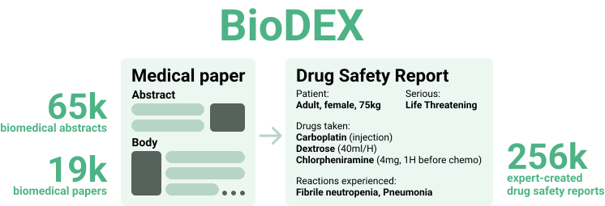

<p align="center" width="100%">

</p>

# BioDEX: Large-Scale Biomedical Adverse Drug Event Extraction for Real-World Pharmacovigilance.

<!-- []()
[]() -->
<!-- []() -->
[](https://www.python.org/downloads/release/python-390/)

This is the official repository for the [BioDEX paper](todo).

BioDEX is a raw resource for drug safety monitoring that bundles full-text and abstract-only PubMed papers with drug safety reports. These reports contain structured information about an Adverse Drug Events (ADEs) described in the papers, and are produced by medical experts in real-world settings.

BioDEX contains 19k full-text papers, 65k abstracts, and over 256k associated drug-safety reports.

## Overview of this repository
This repository is structured as follows:
- `demo.ipynb` contains some quick demonstrations of the data.
- `analysis/` contains the data and notebooks to reproduce all plots in the paper.
- `src/` contains all code to represent the data objects and calculate the metrics.
- `data_creation/` contains the code to create the Report-Extraction dataset starting from the raw resource. Code to create the raw resource from scratch from will be released soon.
- `task/icsr_extraction/` contains the code to train and evaluate models for the Report-Extraction task.

## Installation
Create the conda environment and install the code: 

    conda create -n biodex python=3.9
    conda activate biodex
    pip install -r requirements.txt
    pip install .

## Load the raw resource
```python
import datasets

# load the raw dataset
dataset = datasets.load_dataset("BioDEX/raw_dataset")['train']

print(len(dataset)) # 65,648

# investigate an example
article = dataset[1]['article']
report = dataset[1]['reports'][0]

print(article['title'])    # Case Report: Perioperative Kounis Syndrome in an Adolescent With Congenital Glaucoma.
print(article['abstract']) # A 12-year-old male patient suffering from congenital glaucoma developed bradycardia, ...
print(article['fulltext']) # ...
print(article['fulltext_license']) # CC BY

print(report['patient']['patientsex']) # 1
print(report['patient']['drug'][0]['activesubstance']['activesubstancename']) # ATROPINE SULFATE
print(report['patient']['drug'][0]['drugadministrationroute']) # 040
print(report['patient']['drug'][1]['activesubstance']['activesubstancename']) # MIDAZOLAM
print(report['patient']['drug'][1]['drugindication']) # Anaesthesia
print(report['patient']['reaction'][0]['reactionmeddrapt'])  # Kounis syndrome
print(report['patient']['reaction'][1]['reactionmeddrapt'])  # Hypersensitivity
```

Optional, use our code to parse the raw resource into Python objects for easy manipulation
```python
import datasets
from src.utils import get_matches

# load the raw dataset
dataset = datasets.load_dataset("BioDEX/raw_dataset")['train']
dataset = get_matches(dataset)

print(len(dataset)) # 65,648

# investigate an example
article = dataset[1].article
report = dataset[1].reports[0]

print(article.title)    # Case Report: Perioperative Kounis Syndrome in an Adolescent With Congenital Glaucoma.
print(article.abstract) # A 12-year-old male patient suffering from congenital glaucoma developed bradycardia, ...
print(article.fulltext) # ...
print(article.fulltext_license) # CC BY

print(report.patient.patientsex) # 1
print(report.patient.drug[0].activesubstance.activesubstancename) # ATROPINE SULFATE
print(report.patient.drug[0].drugadministrationroute) # 040
print(report.patient.drug[1].activesubstance.activesubstancename) # MIDAZOLAM
print(report.patient.drug[1].drugindication) # Anaesthesia
print(report.patient.reaction[0].reactionmeddrapt)  # Kounis syndrome
print(report.patient.reaction[1].reactionmeddrapt)  # Hypersensitivity
```

## Load the Report-Extraction dataset
```python
import datasets

# load the report-extraction dataset
dataset = datasets.load_dataset("BioDEX/BioDEX-ICSR")

print(len(dataset['train']))        # 9,624
print(len(dataset['validation']))   # 2,407
print(len(dataset['test']))         # 3,628

example = dataset['train'][0]

print(example['fulltext_processed'][:1000], '...') # TITLE: # SARS-CoV-2-related ARDS in a maintenance hemodialysis patient ...
print(example['target']) # serious: 1 patientsex: 1 drugs: ACETAMINOPHEN, ASPIRIN ...
```

<!-- ## TODO Use our Report-Extraction model
```python
from transformers import AutoModelForSeq2SeqLM, AutoTokenizer

model = AutoModelForSeq2SeqLM.from_pretrained("BioDEX/flan-t5-large-report-extraction")
tokenizer = AutoTokenizer.from_pretrained("BioDEX/flan-t5-large-report-extraction")

# TODO
input = """TODO"""
input = tokenizer.encoder(input)

output = model.predict(**input)

``` -->

<!-- ## TODO: evaluate a prediction -->


## Train and evaluate Report-Extraction models
All code for this task is located in `task/icsr_extraction/`.
Make sure to activate the `biodex` environment!

### Fine-tune a new Report-Extraction model
```shell
cd tasks/icsr_extraction

python run_encdec_for_icsr_extraction.py \
    --overwrite_cache False \
    --seed 42 \
    --dataset_name BioDEX/BioDEX-ICSR \
    --text_column fulltext_processed \
    --summary_column target \
    --model_name_or_path google/flan-t5-large \
    --output_dir ../../checkpoints/flan-t5-large-report-extraction \
    --max_source_length 2048 \
    --max_target_length 256 \
    --do_train True \
    --do_eval True \
    --lr_scheduler_type linear \
    --warmup_ratio 0.0 \
    --learning_rate 0.0001 \
    --optim adafactor \
    --per_device_train_batch_size 1 \
    --per_device_eval_batch_size 4 \
    --gradient_accumulation_steps 4 \
    --eval_accumulation_steps 16 \
    --num_train_epochs 5 \
    --bf16 True \
    --evaluation_strategy epoch \
    --logging_strategy steps \
    --save_strategy epoch \
    --logging_steps 100 \
    --save_total_limit 1 \
    --report_to wandb \
    --load_best_model_at_end True \
    --metric_for_best_model loss \
    --greater_is_better False \
    --predict_with_generate True \
    --generation_max_length 256 \
    --num_beams 1 \
    --repetition_penalty 1.0
```
Thus far, we only consider fine-tuning encoder-decooder models in the paper. Training a decoder-only model is still a work in progress, but we've supplied some code at `./tasks/icsr_extraction/run_decoder_for_icsr_extraction.py`

### Reproduce our fine-tune evaluation run
Using our model on Hugging Face.

```shell
cd tasks/icsr_extraction

python run_encdec_for_icsr_extraction.py \
    --overwrite_cache False \
    --seed 42 \
    --dataset_name BioDEX/BioDEX-ICSR \
    --text_column fulltext_processed \
    --summary_column target \
    --model_name_or_path BioDEX/flan-t5-large-report-extraction \
    --output_dir ../../checkpoints/flan-t5-large-report-extraction \
    --max_source_length 2048 \
    --max_target_length 256 \
    --do_train False \
    --do_eval True \
    --lr_scheduler_type linear \
    --warmup_ratio 0.0 \
    --learning_rate 0.0001 \
    --optim adafactor \
    --per_device_train_batch_size 1 \
    --per_device_eval_batch_size 4 \
    --gradient_accumulation_steps 4 \
    --eval_accumulation_steps 16 \
    --num_train_epochs 5 \
    --bf16 True \
    --evaluation_strategy epoch \
    --logging_strategy steps \
    --save_strategy epoch \
    --logging_steps 100 \
    --save_total_limit 1 \
    --report_to wandb \
    --load_best_model_at_end True \
    --metric_for_best_model loss \
    --greater_is_better False \
    --predict_with_generate True \
    --generation_max_length 256 \
    --num_beams 1 \
    --repetition_penalty 1.0
```

### Reproduce our few-shot in-context learning results
We use the [DSP](https://github.com/stanfordnlp/dsp) framework to perform in-context learning experiments.

At the time of writing, DSP does not support a truncation strategy. This is vital for our task given the long inputs. To fix this and reproduce our results, you need to replace the `predict.py` file of your local dsp package (`path/to/local/dsp/primitives/predict.py`) with the adapted version located at `tasks/icsr_extraction/dsp_predict_path.py`.

Run `text-davinci-003`:
```shell

cd tasks/icsr_extraction

python run_gpt3_for_icsr_extraction.py \
    --max_dev_samples 100 \
    --max_tokens 128 \
    --max_prompt_length 4096 \
    --n_demos 7 \
    --output_dir ../../checkpoints/ \
    --model_name text-davinci-003 \
    --fulltext True
```

Run `gpt-4`:
```shell

cd tasks/icsr_extraction

python run_gpt3_for_icsr_extraction.py \
    --max_dev_samples 20 \
    --max_tokens 128 \
    --max_prompt_length 4096 \
    --n_demos 7 \
    --output_dir ../../checkpoints/ \
    --model_name gpt-4 \
    --chat_model True \
    --fulltext True
```

## Limitations
See section 9 of the [BioDEX paper](todo) for limitations and ethical considerations.

## Contact
Open an issue on this GitHub page or email `karel[dot]doosterlinck[at]ugent[dot].be` and preferrably include "[BioDEX]" in the subject.

## License
BioDEX bundles the following resources:
- [Medline](https://pubmed.ncbi.nlm.nih.gov): This produces all `article` fields except `fulltext` and `fulltext_license`
- [FAERS](https://www.fda.gov/drugs/questions-and-answers-fdas-adverse-event-reporting-system-faers/fda-adverse-event-reporting-system-faers-public-dashboard): This produces all `report` fields and is covered under a CC0 license, as stated [on their website](https://open.fda.gov/data/faers/).
- [PubMed Central Open Access Subset](https://www.ncbi.nlm.nih.gov/pmc/tools/openftlist/): This produced the `fulltext` and `fulltext_license` fields for the `article`. The PubMed Open Access Subset covers papers that are copyrighted under Creative Commens or similar liberal distributions. BioDEX features full-text papers from the commercial (CC0, CC BY, CC BY-SA, CC BY-ND) and non-commercial (CC BY-NC, CC BY-NC-SA, CC BY-NC-ND) set. This license is denoted per applicable BioDEX example in the `fulltext_license` field of the `article`. 

Medline was provided by courtesy of the U.S. National Library of Medicine (NLM). This does not imply the NLM has endorsed BioDEX. The data distributed in BioDEX does not reflect the most current/accurate data available from NLM.

### Create a smaller, commercially licensed BioDEX dataset
Filter the raw resource to only include fulltext papers with a commercial license:

```python
import datasets

# load the raw dataset
dataset = datasets.load_dataset("BioDEX/raw_dataset")['train']
print(len(dataset)) # 65,648

# remove all fulltext papers with no commercial license
commercial_licenses = {'CC0', 'CC BY', 'CC BY-SA', 'CC BY-ND'}

def remove_noncom_paper(example):
    # remove the fulltext if no commercial license, keep all the other data of the example
    if example['article']['fulltext_license'] not in commercial_licenses:
        example['article']['fulltext'] = None
    return example

dataset_commercial = dataset.map(remove_noncom_paper)
print(len(dataset_commercial)) # 65,648 (no examples were dropped, only some fulltext fields were removed)
```

If you want to train a report-extraction model on this commercial dataset, repeat the steps outlined in `data_creation/icsr_extraction/icsr_extraction.ipynb` with this new `dataset_commercial` to create a new report-extraction dataset.

## Citation
Coming soon.
